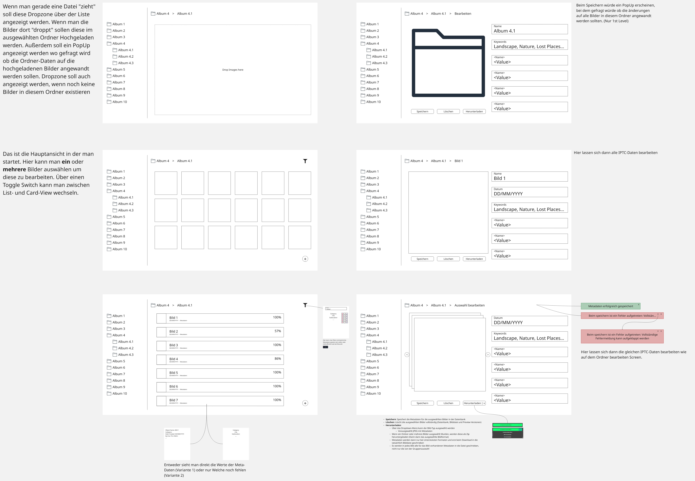

[](https://classroom.github.com/a/cBV3pX2A)

# Web Technologien // begleitendes Projekt Sommersemester 2025

## Working time per issue

| Issue                                                                                                                                                        | Arbeitszeit |
|--------------------------------------------------------------------------------------------------------------------------------------------------------------|-------------|
| [Kernfunktion im Backend erstellen](https://github.com/mi-classroom/mi-master-wt-beiboot-2025/issues/1)                                                      | ~12.30h     |
| [Upload via Web Frontend](https://github.com/mi-classroom/mi-master-wt-beiboot-2025/issues/2)                                                                | ~6h         |
| [Interaktionskonzept- und -design für die Bearbeitung von IPTC Daten](https://github.com/mi-classroom/mi-master-wt-beiboot-2025/issues/3)                    | ~4h         |
| [Realisierung Ihres Interaktionskonzept- und -design für die Bearbeitung von IPTC Daten](https://github.com/mi-classroom/mi-master-wt-beiboot-2025/issues/4) | ~80h        |
| [Eigenes Feature](https://github.com/mi-classroom/mi-master-wt-beiboot-2025/issues/5)                                                                        | ~7h         |
| [Finetuning & Doku](https://github.com/mi-classroom/mi-master-wt-beiboot-2025/issues/6)                                                                      | ~5.45h      |
| **Total**                                                                                                                                                    | **~110h**   |

***Note***:
The estimate
for "[Realisierung Ihres Interaktionskonzept- und -design für die Bearbeitung von IPTC Daten](https://github.com/mi-classroom/mi-master-wt-beiboot-2025/issues/4)"
is rather rough, since this issue was implemented in many smaller sessions and unfortunately not all of them were
recorded. In addition, some hours from the
issues "[Upload via Web Frontend](https://github.com/mi-classroom/mi-master-wt-beiboot-2025/issues/2)"
and "[Eigenes Feature](https://github.com/mi-classroom/mi-master-wt-beiboot-2025/issues/5)" are attributed to the
preceding issue, since parts of these issues were already implemented at an earlier stage.

## Installation

Since some external tools and libraries need to be installed for the application and PHP configurations need to be set,
the easiest way to run a demo is [Docker](https://www.docker.com/).
In the [`src`](./src) directory, you will find both a [Dockerfile](./src/Dockerfile) and a
[`docker-compose.yml`](./src/docker-compose.yml).

To start the container correctly, you first need to create an SQLite database:

```shell
    cd src
    touch database/database.sqlite
```

Then the container can be started:

```shell
    docker compose up -d --build
```

After that, the application is (by default) available at [http://localhost:8000](http://localhost:8000).
The login credentials for the test user are:

* Email: `test@example.com`
* Password: `password`

In the [`docker-compose.yml`](./src/docker-compose.yml) two commands are defined. One only starts the Laravel
application, the other also resets the database.

## Interaction Concept

As part of the
Issue "[Interaktionskonzept- und -design für die Bearbeitung von IPTC Daten](https://github.com/mi-classroom/mi-master-wt-beiboot-2025/issues/3)",
an interaction concept was to be designed, which was then to be implemented later.
In the concept for this application, 6 different screens were originally designed, most of which made it into the
implementation.



The following features have not yet made it into the application:

* Card-view of the images
* Free text filter for filtering the images
